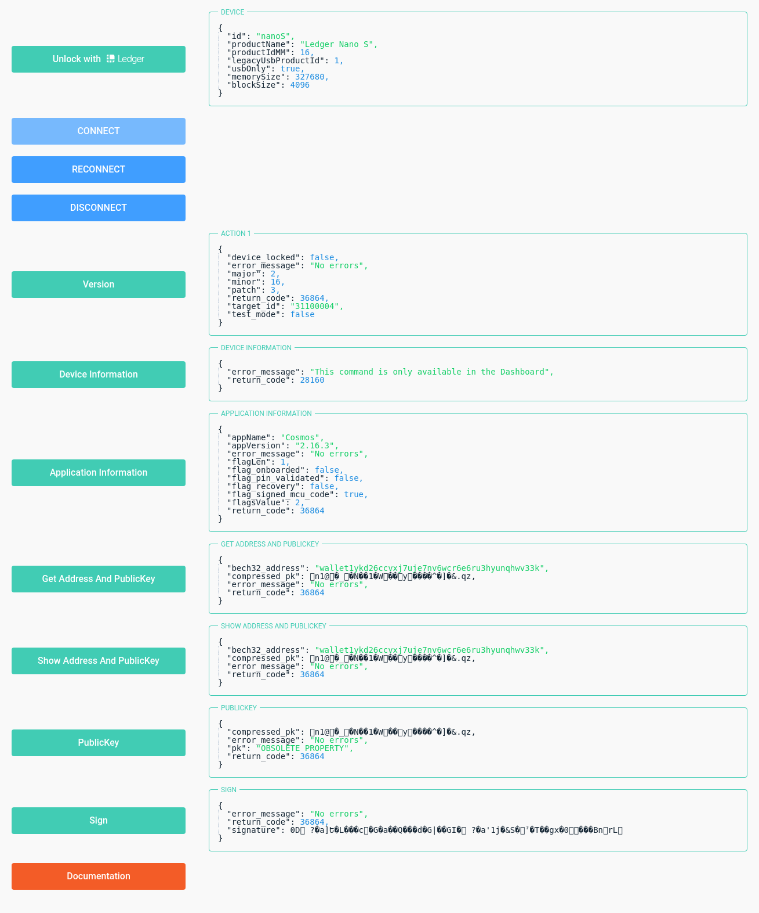

<!-- START doctoc generated TOC please keep comment here to allow auto update -->
<!-- DON'T EDIT THIS SECTION, INSTEAD RE-RUN doctoc TO UPDATE -->


  - [storybook-addon-meta](#storybook-addon-meta)
  - [Installation](#installation)
  - [Demo](#demo)
  - [Documentation](#documentation)
  - [Screenshot](#screenshot)
- [Classes](#classes)
  - [Class: Meta](#class-meta)
    - [Properties](#properties)
    - [Usage](#usage)
    - [Demo](#demo-1)
    - [Table of contents](#table-of-contents)
    - [Constructors](#constructors)
    - [Methods](#methods)
- [storybook-addon-meta](#storybook-addon-meta-1)
  - [Table of contents](#table-of-contents-1)
    - [Modules](#modules)
- [Modules](#modules-1)
  - [Module: index](#module-index)
    - [Table of contents](#table-of-contents-2)
    - [References](#references)
  - [Module: lib/Meta](#module-libmeta)
    - [Table of contents](#table-of-contents-3)
  - [Module: log](#module-log)
    - [Table of contents](#table-of-contents-4)
    - [Variables](#variables)
  - [Module: types/declaration](#module-typesdeclaration)

<!-- END doctoc generated TOC please keep comment here to allow auto update -->


<a name="readmemd"></a>

storybook-addon-meta / [Exports](#modulesmd)

## storybook-addon-meta

#### Meta information for Storybook components

## Installation

Install with [npm](https://www.npmjs.com):

```sh
$ npm install --save storybook-addon-meta
```

Install with [yarn](https://yarnpkg.com):

```sh
$ yarn add storybook-addon-meta
```

## [Demo](https://storybook-addon-meta.netlify.app/)

#### [Try online demo](https://storybook-addon-meta.netlify.app/)

## [Documentation](https://www.npmjs.com/package/storybook-addon-meta)

#### [Try online documentation](https://www.npmjs.com/package/storybook-addon-meta)

## Screenshot



# Classes


<a name="classeslib_metametamd"></a>

[storybook-addon-meta](#readmemd) / [Exports](#modulesmd) / [lib/Meta](#moduleslib_metamd) / Meta

## Class: Meta

[lib/Meta](#moduleslib_metamd).Meta

### Properties

```js
    static componentPath(component: any): string;
    static componentName(component: any): string;
```

### Usage

#### es module
```js
import { Meta } from 'storybook-addon-meta'

const path = Meta.componentPath(component); // return component path
const name = Meta.componentName(component); // return component name
```

#### commonjs
```js
var Meta = require('storybook-addon-meta').Meta;

var path = Meta.componentPath(component); // return component path
var name = Meta.componentName(component); // return component name
```

### [Demo](https://storybook-addon-meta.netlify.app/)

#### [Try online demo](https://storybook-addon-meta.netlify.app/)

#### es module
```js
const path = Meta.componentPath(component); // return component path
const name = Meta.componentName(component); // return component name
```

#### commonjs
```js
var path = Meta.componentPath(component); // return component path
var name = Meta.componentName(component); // return component name
```

### Table of contents

#### Constructors

- [constructor](#constructor)

#### Methods

- [componentName](#componentname)
- [componentPath](#componentpath)

### Constructors

#### constructor

\+ **new Meta**(): [*Meta*](#classeslib_metametamd)

**Returns:** [*Meta*](#classeslib_metametamd)

### Methods

#### componentName

▸ `Static`**componentName**(`component`: *any*): *string*

##### Parameters:

| Name | Type |
| :------ | :------ |
| `component` | *any* |

**Returns:** *string*

Defined in: [lib/Meta.ts:31](https://github.com/idimetrix/storybook-addon-meta/blob/c894199/src/lib/Meta.ts#L31)

___

#### componentPath

▸ `Static`**componentPath**(`component`: *any*): *string*

##### Parameters:

| Name | Type |
| :------ | :------ |
| `component` | *any* |

**Returns:** *string*

Defined in: [lib/Meta.ts:17](https://github.com/idimetrix/storybook-addon-meta/blob/c894199/src/lib/Meta.ts#L17)


<a name="modulesmd"></a>

[storybook-addon-meta](#readmemd) / Exports

# storybook-addon-meta

## Table of contents

### Modules

- [index](#modulesindexmd)
- [lib/Meta](#moduleslib_metamd)
- [log](#moduleslogmd)
- [types/declaration](#modulestypes_declarationmd)

# Modules


<a name="modulesindexmd"></a>

[storybook-addon-meta](#readmemd) / [Exports](#modulesmd) / index

## Module: index

### Table of contents

#### References

- [Meta](#meta)

### References

#### Meta

Re-exports: [Meta](#classeslib_metametamd)


<a name="moduleslib_metamd"></a>

[storybook-addon-meta](#readmemd) / [Exports](#modulesmd) / lib/Meta

## Module: lib/Meta

### Table of contents

#### Classes

- [Meta](#classeslib_metametamd)


<a name="moduleslogmd"></a>

[storybook-addon-meta](#readmemd) / [Exports](#modulesmd) / log

## Module: log

### Table of contents

#### Variables

- [log](#log)

### Variables

#### log

• `Const` **log**: Logger

Defined in: [log.ts:3](https://github.com/idimetrix/storybook-addon-meta/blob/c894199/src/log.ts#L3)


<a name="modulestypes_declarationmd"></a>

[storybook-addon-meta](#readmemd) / [Exports](#modulesmd) / types/declaration

## Module: types/declaration
